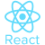

    
    
    
    

### Hi there 👋
### I'm a self-taught Full-Stack (MERN) Developer.

- 🔭 I’m currently working on a Social Media Application for my portfolio.
- 👯 I’m looking to collaborate on Hackathon Project.
- 💬 Ask me about Code, Coffee, Cosmos or Philosophy
- 🥈 Won Data-Day-Grind Hackathon by MLH.io
- 📫 How to reach me: DM me on twitter.
- 😄 Pronouns: He

###  Took Havard's CS50x Course.
###  Participating in Google Code-In Open-Source Contribution program since 2018.
### Feel Free To take a look at My Projects. 👍
