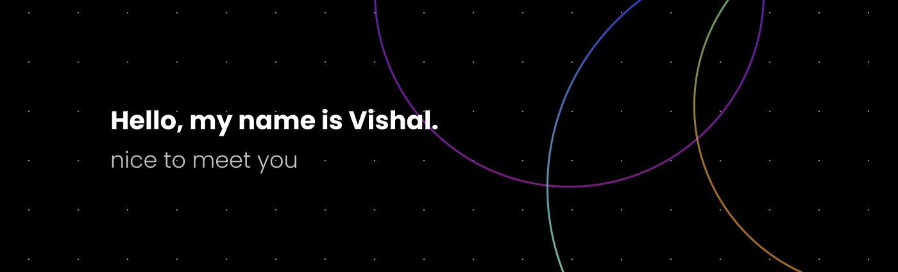

<h2>Hi there 👋, I am Vishal Kumar</h2>

I'm a self-taught Full-Stack (MERN) Developer with a passion for coding, innovation, and exploration.

<!-- 

  

 -->
<h3>About Me</h3>
<!-- 
  
  

 -->
<ul>
  <li><b>🔭 Currently, Looking for SDE Internship/Fulltime Role.</b></li>
  <li>👯 I love collaborating on Hackathon Projects, where innovative ideas come to life.</li>
  <li>💬 Ask me about Code, Coffee, Cosmos, or Philosophy - I'm always up for intriguing discussions.</li>
  <li>🥈 Proud winner of 8 Hackathons by MLH.io, showcasing my dedication to creative problem-solving.</li>
  <li>📫 How to reach me: Feel free to DM me on Twitter.</li>
</ul>
<h3>Let's Connect</h3>

I'm always open to connect and collaborate. Let's build something amazing together!

  
  
  
  

<h3>Tech Stack</h3>

  
  
  
  
  
  
  
  
  
  <!-- ... (Include the rest of your badges here) -->

  
  
  
  
  

<h3>My Achievements</h3>

  
  Took Harvard's CS50x Course

  
  Participated in Google Code-In Open-Source Contribution program since 2018

<h3>Projects</h3>

Feel free to take a look at my projects. Your feedback is highly appreciated! 👍

  <!-- Insert your project showcases here -->

  

  

